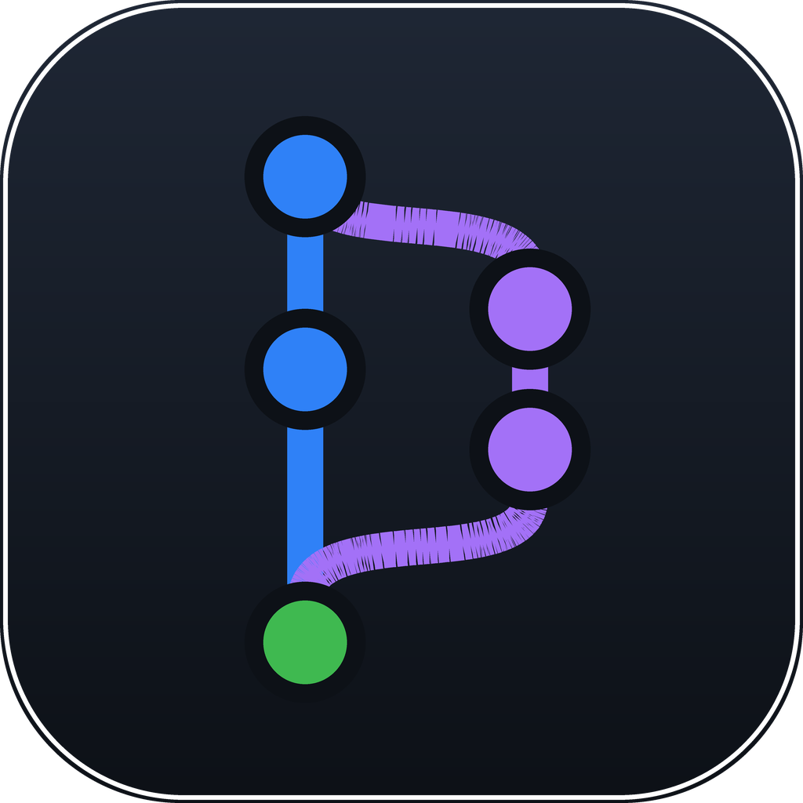

<div align="center">
  

# Vibe Studio

**The IDE for vibe coding.** Git, terminals, diffs, and a first-class dock for
AI coding agents — in a fast, minimal, native macOS app.


</div>

Like VS Code without all the extra stuff: source control you can see, real
terminals, a proper diff viewer, and multi-repo workspaces built around
agent-driven development. Built with [Tauri 2](https://tauri.app) — native
WKWebView, no bundled Chromium — so it stays light on CPU and RAM.

## Features

### 🗂 Multi-repo workspaces

- Every open repo is a tab in the titlebar with its own editor, terminals,
  search, and source control — all workspaces stay alive, so switching is
  instant and nothing reloads
- Jump with **⌘1–9**, double-click a tab to rename it, right-click to pick a
  **per-project accent color** that tints the whole app
- Session restore: your workspaces, layouts, and agent terminals come back
  on relaunch

### 🌱 Source control

- Stage / unstage / discard, commit (+ amend, commit & push), stash
  (save / apply / pop / drop), fetch / pull / push using your existing git
  auth and credential helpers
- **Commit graph** with colored branch lanes, branch & tag pills, and a
  branch filter; virtualized so huge histories stay smooth
- Click a commit to browse and diff its files; multi-select + right-click
  for checkout, branch creation, squash, and copy-SHA
- A debounced file watcher keeps status, log, and graph live — including
  changes made by external `git` commands

### 🤖 Agent terminal dock

A global dock purpose-built for AI coding agents (Claude Code & friends):

- New agent terminals **launch `claude` automatically** in the project
  root — quit the agent and you're in a plain shell
- Agent terminals are pinned to a **project**, not a window — they keep
  running when their workspace closes, and clicking one jumps straight to
  its project
- **Busy / needs-attention indicators** surface what each agent is doing
  across the dock, titlebar tabs, and status bar
- Live **session-summary badges** show each agent's current topic
- Drag & drop tabs into splits; layout persists across restarts
- Drop a file or image from Finder onto a pane to paste its path — image
  drops work with Claude Code out of the box

### ⌨️ Terminals

- Real PTYs running your login shell, with tabs, side-by-side splits, and
  drag-and-drop layout
- WebGL-accelerated rendering (xterm.js 6) with backpressure-aware
  streaming, so `cat`-ing a huge file won't wedge the app
- **⌘⇧B task runner**: VS Code-compatible `.vscode/tasks.json`, with a
  quick-pick overlay, `${variable}` substitution, and panel reuse rules

### ✍️ Editor & navigation

- CodeMirror 6 tabs with on-demand language loading, unsaved-draft
  recovery, and external-change reload with save-conflict protection
- **⌘P quick open** — fuzzy file matching (gitignore-aware) with match
  highlighting
- **⌘⇧F workspace search** — parallel Rust walk with case / whole-word /
  regex toggles; results open at the matching line
- **⌘F find & replace** — floating VS Code-style widget in every editor
  and diff
- Lazy file explorer, whole-app zoom (**⌘+ / ⌘− / ⌘0**)

### 🔍 Diff viewer

- Side-by-side or unified, syntax-highlighted, unchanged regions collapsed
- Working-tree diffs are **editable** — fix what you see and ⌘S saves it
- Auto-refreshes when the repo changes underneath it

## Keyboard shortcuts

| Keys | Action |
|---|---|
| ⌘ P | Quick open file |
| ⌘ ⇧ F | Search across the workspace |
| ⌘ F | Find / replace in the editor |
| ⌘ ⇧ B | Run build task |
| ⌘ ` | Toggle terminal panel |
| ⌘ B | Toggle sidebar |
| ⌘ 1–9 | Switch to the Nth workspace |
| ⌘ W | Close editor tab |
| ⌘ S | Save file / working-tree diff edit |
| ⌘ ↩ | Commit (focus in message box) |
| ⌘ + / ⌘ − / ⌘ 0 | Zoom in / out / reset |

## Architecture

| Layer | Tech |
|---|---|
| Shell | Tauri 2 (Rust) |
| Git | `git2` (libgit2); network ops shell out to `git` CLI for your ssh/credential helpers |
| Terminals | `portable-pty` → base64 events with ack-based flow control → xterm.js 6 |
| Watcher | `notify` (FSEvents), debounced per repo |
| Search & quick open | `ignore`-crate parallel worktree walks in Rust |
| UI | React 19 + Vite, zustand, CodeMirror 6, `@codemirror/merge` |

## Development

```sh
pnpm install
pnpm tauri dev      # run the app in dev mode
pnpm tauri build    # produce .app / .dmg in src-tauri/target/release/bundle
```

## Installing / updating the release build

There's no auto-updater — installing and updating are the same operation:
build, then copy the bundle into `/Applications`.

```sh
pnpm tauri build
rm -rf "/Applications/Vibe Studio.app" && ditto \
  "src-tauri/target/release/bundle/macos/Vibe Studio.app" \
  "/Applications/Vibe Studio.app"
```

Notes:

- **Quit the app first** when updating a running install.
- The `rm -rf` matters: `ditto` *merges* into an existing bundle, so copying
  over an old install can leave stale files behind if something was renamed
  or removed between builds. Deleting first guarantees a clean bundle.
- Settings survive updates — persisted state (workspaces, terminal layouts,
  project colors) lives in WebKit storage under `~/Library/` keyed by bundle
  id, not inside the .app. The dev build (`pnpm tauri dev`) keeps its own
  separate state.
- No Gatekeeper friction: locally built apps aren't quarantined (that only
  applies to downloads).

## License

[MIT](LICENSE) © Kevin Duong
